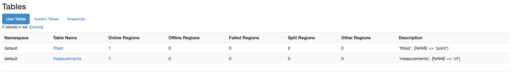

# HBase configuration and tests

We added a table to HBase named measurements:




That table has a table family of CF.


To create the table, we used the HBase Shell:


Login the HBase shell:

```
[hdfs@ip-172-31-47-126 ~]$ hbase shell

```

```
17/06/30 12:42:18 INFO Configuration.deprecation: hadoop.native.lib is deprecated. Instead, use io.native.lib.available
HBase Shell; enter 'help<RETURN>' for list of supported commands.
Type "exit<RETURN>" to leave the HBase Shell
Version 1.2.0-cdh5.11.1, rUnknown, Thu Jun  1 10:19:43 PDT 2017
```

Enter the command to create the table:
```
hbase(main):002:0> create 'measurements', 'cf'
```
```
0 row(s) in 1.3800 seconds

=> Hbase::Table - measurements
hbase(main):003:0>

```
