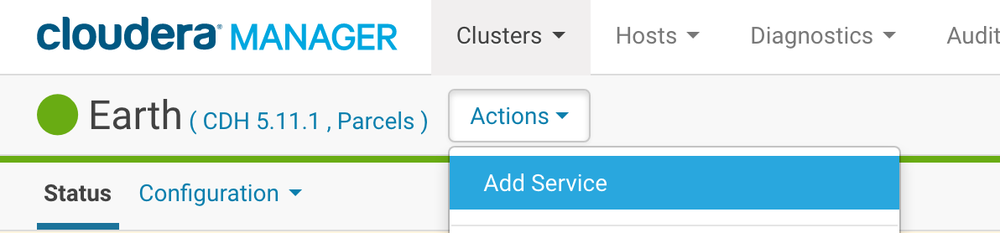
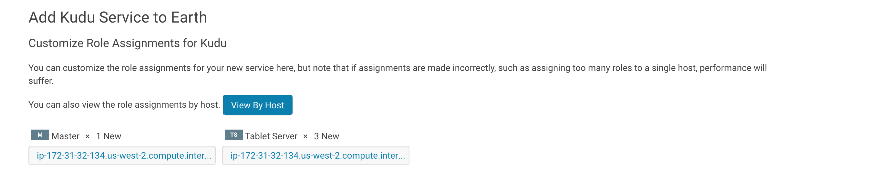
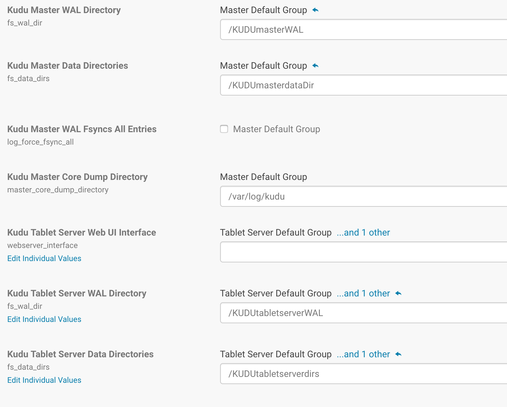
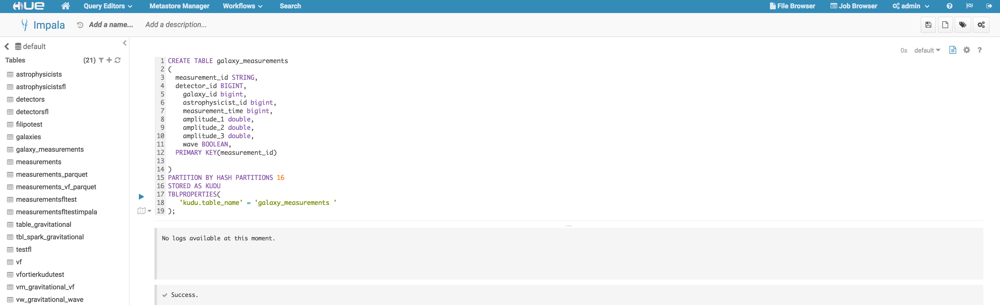

# Kudu installation and configuration

## Installation

Kudu was not installed  as part of the cluster so we had to install Kudu and configure it first.

1. Go to the cluster and click actions and then add service

  

2. Select Kudu and click continue

  

3. Select one master server and at least 3 tablet servers

  

4. Configure the folders as you prefer, here are the values we piked

  

5. Congrats! You should now have a valid Kudu install.

## Create a table from Impala

You can create tables from Impala and store the table in Kudu. You can do it from the Impala Shell or from Hue. We used Hue to do it.


Here is the code to create the table in Kudu:

```
CREATE TABLE galaxy_measurements
(
  measurement_id STRING,
  detector_id BIGINT,
    galaxy_id bigint,
    astrophysicist_id bigint,
    measurement_time bigint,
    amplitude_1 double,
    amplitude_2 double,
    amplitude_3 double,
    wave BOOLEAN,
  PRIMARY KEY(measurement_id)

)
PARTITION BY HASH PARTITIONS 16
STORED AS KUDU
TBLPROPERTIES(
   'kudu.table_name' = 'galaxy_measurements'
);
```


and here is a screenshot of the success:


