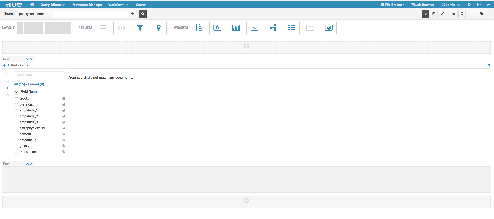

# Solr documentation

Configuration of Solr was tricky at first, we needed to figure out how to create a collection.

After searching a bit, we found this site: [Example solrctl Usage](https://www.cloudera.com/documentation/enterprise/latest/topics/search_solrctl_examples.html)


## Solr collection configuration
By using this documentation, we did the configuration as follow:


1. log in with HDFS

  ```
  sudo su - hdfs
  ```

2. run this command

  ```
  solrctl --solr http://ip-172-31-32-134.us-west-2.compute.internal:8983/solr instancedir --generate $HOME/solr_configs
  ```

3. Edit the file $HOME/solr_configs/conf/schema.xml and replace the content with the file in github. (here : [schema.xml](schema.xml) )

4. run these two commands

  ```
  solrctl --solr http://ip-172-31-32-134.us-west-2.compute.internal:8983/solr instancedir --create galaxy_collection $HOME/solr_configs
  ```

  ```
  solrctl --solr http://ip-172-31-32-134.us-west-2.compute.internal:8983/solr collection --create galaxy_collection -s 1

  ```


## Solr Interface
This is what the Solr interface looks like with no data in it:


